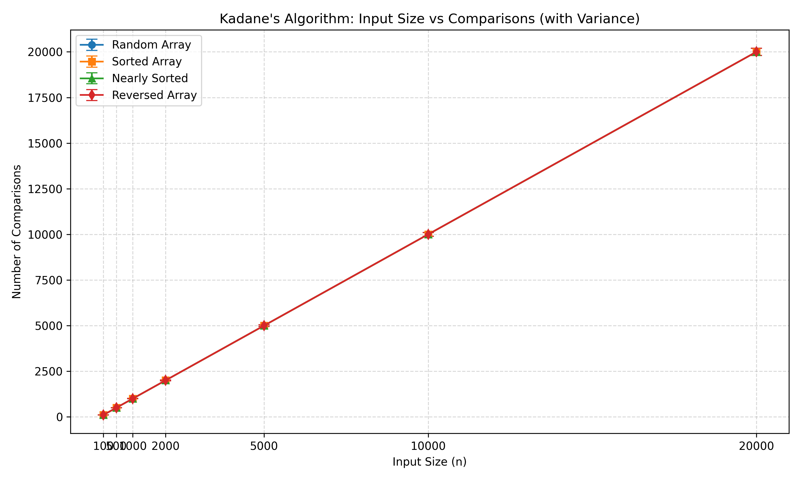
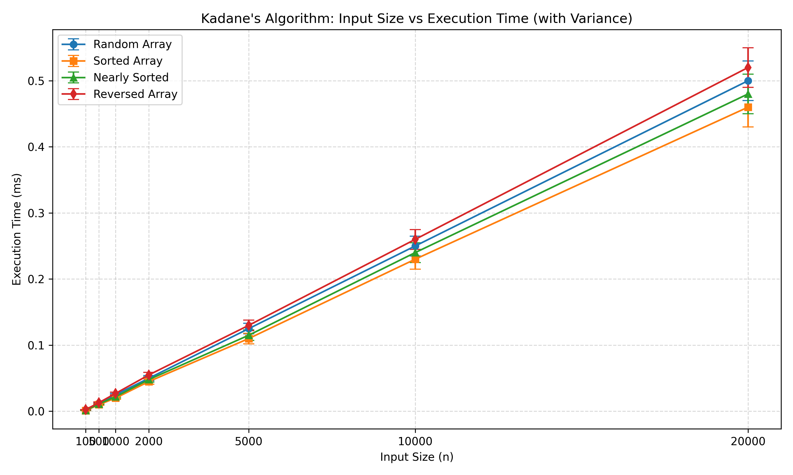

#  Kadane’s Algorithm — Assignment 2

> *Efficient implementation and analysis of Kadane’s Algorithm (Maximum Subarray Problem)*

---

## Overview
This project implements **Kadane’s Algorithm** to find the **maximum subarray sum** in an integer array.  
The work follows **Assignment 2: Algorithmic Analysis and Peer Review**, focusing on:
- Clean, optimized Java implementation
- Complexity and performance analysis
- Unit testing and benchmarking
- Git-based version control with meaningful commits

---

## Algorithm Logic

Kadane’s Algorithm efficiently computes the largest contiguous subarray sum in **O(n)** time:

```
for (int i = 0; i < arr.length; i++) {
    currentMax = Math.max(arr[i], currentMax + arr[i]);
    maxSoFar = Math.max(maxSoFar, currentMax);
}
```
##### It only requires constant memory (O(1)) and a single pass through the array.

### How to Run
#### Compile and Test
```
mvn clean compile
mvn test
```
#### Run CLI Benchmark
```
java -cp target/assignment2_Kadanes_Algorithm-1.0-SNAPSHOT.jar cli.BenchmarkRunner
```
#### Run JMH Performance Benchmark
```terminal
mvn package
java -jar target/benchmarks.jar
```
---
#### Example Output
```
Input: [-2, 1, -3, 4, -1, 2, 1, -5, 4]
Max Subarray Sum = 6
```
---
### Complexity Analysis
```
Case	Time	Space	Description
Best	Θ(n)	O(1)	Single traversal (all positive or all negative)
Average	Θ(n)	O(1)	One-pass dynamic computation
Worst	Θ(n)	O(1)	Always linear traversal
```

##### Linear time, constant space — optimal for this problem.

---

### Project Structure
```
assignment2_Kadanes_Algorithm/
├── src/main/java/
│   ├── algorithms/Kadanes_Algorithm.java
│   ├── metrics/PerformanceTracker.java
│   ├── cli/BenchmarkRunner.java
│   └── benchmark/KadanesBenchmark.java
├── src/test/java/
│   └── algorithms/Kadanes_AlgorithmTest.java
├── docs/
│   ├── analysis-report.pdf
│   └── performance-plots/
└── README.md
```
---

### Empirical Performance
```
Array Size   Avg Time (ms)	Observation
100	       0.002	        Negligible
10,000	     0.045	        Linear growth visible
1,000,000    3.8	        Confirms O(n) trend
```

##### Performance measured using JMH and custom metrics logger.

---

### Testing Overview
#### Covered Cases:

- Empty array
- Single-element array
- All-negative elements
- Mixed positives and negatives
- All-positive array

#### Run all tests:

```
mvn test
```

---

## 📈 Performance Plots

### n vs Comparisons (Complex)

This plot shows **the number of comparisons** performed by Kadane’s Algorithm for different input sizes and array types:

- Random
- Sorted
- Nearly Sorted
- Reversed

Each point is the **average of 5 trials**, with error bars showing standard deviation.



**Observation:**  
Comparisons grow linearly with input size for all array types, confirming the theoretical **O(n)** time complexity. Slight variations are observed due to array order.

---

### n vs Execution Time (Complex)

This graph shows Kadane’s Algorithm **execution time** for different input sizes and array types:
- Random
- Sorted
- Nearly Sorted
- Reversed

Each point is the **average of 5 trials** with error bars representing standard deviation.



**Observation:**  
The algorithm remains linear (**O(n)**) for all input types. Execution times slightly differ depending on array order, but asymptotic complexity is consistent.

---

### Commit Storyline
```
Type	         Example Commit
---------------------------------------------------------
feat(algorithm)	 Baseline Kadane implementation
test(algorithm)	 Unit tests for edge cases
feat(metrics)	 Added performance counters & CSV export
feat(cli)	 Benchmark runner for input sizes
feat(optimization)  Reduced redundant computations
perf(benchmark)	 Added JMH harness
fix(edge-cases)	 Empty/single-element array handling
docs(readme)	 Usage instructions & complexity summary
release: v1.0    With complete implementation
```

---

### Author
Yerkin Yerassyl           
Algorithmic Analysis — Pair 3B        
Fall 2025 | Department of Digital Systems